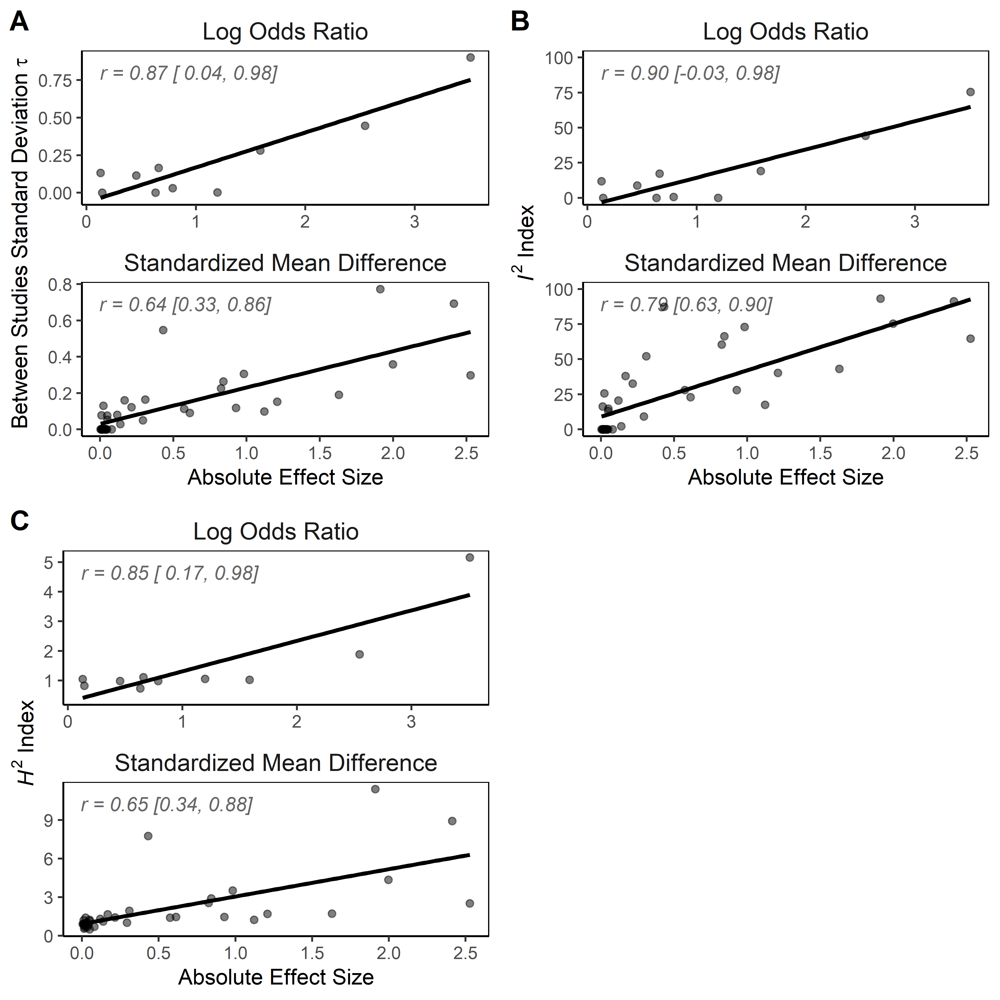

```{r setup, include=FALSE}
knitr::opts_chunk$set(echo = FALSE, message = FALSE, warning = FALSE)
```

```{r load packages, data and source functions}
if(!require(readr)){install.packages("readr")}
if(!require(metafor)){install.packages("metafor")}
if(!require(dplyr)){install.packages("dplyr")}
if(!require(purrr)){install.packages("purrr")}
if(!require(kableExtra)){install.packages("kableExtra")}
if(!require(papaja)){install.packages("papaja")}

library(readr) #To load data
library(dplyr) #For data transformation
library(purrr) #For data iteration
library(metafor) #To run meta-analyses
library(kableExtra) #For creating good-looking pdf tables
library("papaja") #APA formatting of .rmd -> word


dat <- read_csv("../data/collated_summary_data.csv")

source("../code/helper_functions_tables_figures.r") #Load functions to prep data for figures
```
Empirical research is typically portrayed as proceeding in two stages. First, belief in the existence of an effect is established. Second, the effect's generalizability is examined by exploring its boundary conditions. In the first stage, inferential statistics are used  to minimize the risk that a discovery is due to sampling error.  In the second stage, one may ask to what extent the effect depends on a particular choice of four contextual factors; the 1) sample population, 2) settings, 3) treatment variables and 4) measurement variables [@Campbell2015]. This extent is often explored through replications of the original study that are either as similar as possible to the original (called 'direct' or 'exact' replications) or with some deliberate variation on conceptual factors [so-called 'conceptual' or 'indirect' replications; @10.1017/S0140525X17001972], and once sufficient studies have accumulated through meta-analysis. In meta-analysis, the heterogeneity of an effect size (henceforth referred to as heterogeneity) is a measure of an effect's susceptibility to changes in these four factors. An effect strongly dependent on one or more of the four factors, unless controlled for, should exhibit high heterogeneity. In this paper we examine the heterogeneity in replication studies in psychology , focusing on direct replications, and explore a proposed relationship between effect size and heterogeneity. 

Heterogeneity is of concern for several reasons. First and foremost, unaccounted for heterogeneity can have practical consequences not to be ignored. This is readily evident for medicine, where in the case of heterogeneity an intervention, such as a medication, that is successful for some may have direct negative health consequences for others. The same is true of mental health interventions in psychology, but heterogeneity can also have major consequences for topics such as child development, education, and business performance, where psychological research often impacts policy recommendations. Thus, heterogeneity should be no less of a concern for psychologists than for medical practitioners.

Second, unaccounted for heterogeneity is an indication of incomplete theory, since it suggests that a theory is unable to predict all contextual factors of importance to its claims. As such, heterogeneity might imply previously unknown predictors, so called 'hidden moderators' [@10.2139/ssrn.2820883], the discovery of which can be seen as an opportunity for theoretical advancement [@Tackett2017]. 
 
Third,  the possibility of heterogeneity can create controversy in the interpretation of replication results. The proclamation of a  'failure' to replicate an effect is sometimes taken to imply that the original find was merely a statistical fluke, due to 'p-hacking' [@10.1177/0956797611417632] or publication bias [@10.2139/ssrn.2659409]. Unsurprisingly, some researchers take offense [e.g., @10.1016/j.jesp.2016.02.003]. An alternative explanation for non-replication, often espoused by the original authors [e.g, @10.2139/ssrn.2698810; @10.1177/1745691616674460], is that the effect is more heterogeneous than (perhaps implicitly) claimed originally. Such explanations may be valid or not, but even if valid, an effect is typically of less general interest the more specific circumstances it requires to appear. To attenuate the risk of heated discussions on the (non)existence of an effect, original authors may wish to consider pre-specifying the degree of heterogeneity that would make even them lose interest in the effect (e.g., by declaring 'constraints on generality' [@10.1177/1745691617708630]. To conclude, heterogeneity or its absence provides vital information for the implementation of research in practice, the advancement of theory, and the interpretation of research outcomes.

Heterogeneity also affects meta-analytic techniques used to statistically summarize findings on a certain topic. Techniques that attempt to correct for publication bias in their estimate tend to fail in the presence of heterogeneity [@10.1177/1745691616662243; @10.1037/met0000025; @10.1177/1745691616650874], which is problematic considering widespread publication bias [@10.1007/s11192-011-0494-7] and its impact on meta-analytic estimates. In addition, heterogeneity alters the interpretation of meta-analytic estimates as either _the_ true effect size (under homogeneity) or the average of the true effect sizes (under heterogeneity), though one may question the usefulness of interpreting the average true effect size in the presence of heterogeneity [@Simonsohn2017], just as it may be questionable to interpret an average main effect in the context of an interaction effect [@Aiken1991].

It is a commonly believed that heterogeneity is the norm in psychology.  In support of this notion, recent large scale reviews of meta-analyses in psychology [@Stanley2017; @10.5334/jopd.33] report median heterogeneity levels that can best be described as 'large' [see next paragraph; @10.1136/bmj.327.7414.557]. In comparison, the median heterogeneity estimate in medicine [@10.1136/bmj.39343.408449.80] would be considered 'small' by the same standard. It may simply be that effects in psychology are more heterogeneous than those of medicine. However, meta-analyses in psychology also typically include more studies than those in medicine, and it could be that they tend to include studies from a much broader spectrum. The median number of studies (effects) per meta-analysis in the psychology sample of @10.5334/jopd.33 was 12, whereas in medicine it is only 3 [@10.1186/1471-2288-11-160]. It is difficult to separate these explanations (intrinsically more heterogeneity, or psychology simply including studies from a broader spectrum?). To facilitate doing so, in this paper we focus on meta-analyses of only direct replications, which are exempt from the potential problem of including too disparate studies. In reference to meta-analyses of direct replications, several authors [@10.1177/1745691616662243; @Tackett2017] have argued that if we were to expect heterogeneity to be absent or minimal anywhere, it would be in pre-registered multi-lab projects with a common protocol [such as @10.1027/1864-9335/a000178]. They further argue that the fact that heterogeneity has been reported even under such circumstances is an indication of widespread heterogeneity in psychology. However, even in the case of multi-lab direct replication projects, studies will still vary on two contextual factors (sample population and settings) and if we believe an effect is sensitive to changes in these two factors we might also expect to find some heterogeneity. 

###Quantifying heterogeneity

One problem lies in the assessment of heterogeneity and its inherent uncertainty. Heterogeneity is often measured by the $I^2$ index [@10.1002/sim.1186;  @10.1136/bmj.327.7414.557], which allows comparison of estimates across meta-analyses and has an intuitive interpretation. It can be interpreted as the percentage of variability in observed effect sizes in a meta-analysis that is due to heterogeneity amongst the true effects (that is, sensitivity to contextual factors) rather than sampling variance, and ranges from 0-100%. The $I^2$ index is a transformation of the well-known Q-test of heterogeneity in meta-analysis [@10.2307/3001666] by taking $[Q - (k - 1)] / Q \times 100$%, where k is the number of studies included in the meta-analysis and a negative $I^2$ is set to zero. @10.1136/bmj.327.7414.557 tentatively defined $I^2$-values of 25, 50, and 75% as small/medium/large heterogeneity respectively. Tests of heterogeneity typically have low statistical power in many practical situations [@10.1002/sim.2481; @10.1037/1082-989X.11.2.193]. This complicates the discussion of heterogeneity, because while $I^2$ always provides an estimate of heterogeneity, this estimate is often accompanied by wide confidence intervals [@10.1136/bmj.39343.408449.80]. For example, Ioannidis reports that in a large set of Cochrane meta-analyses, all meta-analyses with $I^2$ point estimates of 0% had upper 95% confidence intervals that exceeded 33%, exceeding what @10.1136/bmj.327.7414.557 defined as 'small' heterogeneity. In addition, under homogeneity $I^2$ has a central chisquare distribution [@10.1186/s12874-015-0024-z], a distribution that is right-skewed with more than 40% of observations falling above the expected value (for all k > 4). In other words, even in the absence of heterogeneity, a meta-analysis of 5 or more studies will have an $I^2$ point estimate above zero in more than 40% of cases. Heterogeneity estimates may thus be congruent with a wide range of true heterogeneity levels. Despite exhortations to the contrary [@10.1136/bmj.39343.408449.80], it remains common to omit confidence intervals in the reporting of $I^2$. In consideration of such uncertainty and the prevalent belief that heterogeneity is the norm in psychology, we examine the existing evidence for heterogeneity in psychology using a sample of pre-registered multi-lab direct replication projects.

Effect size is likely associated with heterogeneity. Intuitively, it makes sense to believe that if there is no meta-analytic effect there is nothing to moderate (i.e., no heterogeneity). However, a null or near null effect size estimate may arise from failure to consider contextual factors ('hidden moderators'; @10.2139/ssrn.2820883) and does not by itself imply the absence of heterogeneity. A large meta-analytic effect size on the other hand, can be expected to be associated with more heterogeneity. To illustrate, consider a meta-analysis of say, the correlation between neuroticism and procrastination. Each included study would need to measure the two variables somehow, possibly the same way across studies. However, because of individual differences and differences in study samples, measurement reliabilities may differ across studies either due to sampling variance (that the sample happens to be more or less homogeneous) or to differences in contextual factors (e.g., sampling population, method of measurement). This means that even if the underlying true effect size is the same, the observed correlation between the two variables will differ between studies [see also @Schmidt2015]. Keeping measurement reliabilities constant, differences in observed effect sizes will increase with the underlying true effect, resulting in more variability being ascribed to heterogeneity. More formally, an observed correlation $r_{xy}$ can be expressed as the product of the true correlation or effect size, $\rho_{xy}$, multiplied by the square root of the measurement reliabilities for X ($R_{xx'}$) and Y ($R_{yy'}$): $r_{xy} = \rho_{xy} \times \sqrt{R_{xx'}} \times \sqrt{R_{yy'}}$. As such, keeping constant study differences in $\sqrt{R_{xx'}} \times \sqrt{R_{yy'}}$ while increasing true effect size $\rho_{xy}$ increases the observed differences between studies, thereby increasing heterogeneity of observed effect sizes (see Table 1). We explore the association between effect size and heterogeneity in a sample of pre-registered multi-lab replication projects in psychology.

Table 1.

_Heterogeneity may increase with effect size_

```{r effect-size-heterogeneity-table}
#library(kableExtra)
rooted_relabilities <- matrix(rep(c(.6, .7,.8), 3), ncol = 3)
rho <- c(0, .3, .5)
rel <- c("R = .6", "R = .7", "R = .8")

rooted_relabilities <- sweep(rooted_relabilities, 2, rho, "*")
rooted_relabilities <- data.frame(rel, rooted_relabilities)

diff_row <- data.frame(rel = "Standard deviation", X1 = sd(rooted_relabilities$X1), X2 = sd(rooted_relabilities$X2), X3 = sd(rooted_relabilities$X3))

het_demo <- rbind(rooted_relabilities, diff_row)

het_demo %>% knitr::kable(col.names = c("", "Rho = 0", "Rho = .3", "Rho = .5"), digits = 2)

```

**Note.** R = square root of the multiplied reliabilities. Rho = true effect size. Code to reproduce table: osf.io/kf6pt/

We examine the evidence for widespread heterogeneity in psychology and explore the correlation between effect size and heterogeneity, using ten pre-registered multi-lab replication projects in psychology (Table 2). These ten projects examined a total of 37 primary outcome variables and arguably represent the best, least biased, meta-analytic data currently available in psychology. To better interpret the heterogeneity estimates we also estimate power of each project to find zero/small/medium/large heterogeneity as defined by @10.1136/bmj.327.7414.557. Consequently, our analyses will provide information on how two contextual factors (sample population and settings) may affect consistency or heterogeneity of effects in psychology.

Table 2.

_Pre-registered multi-lab replication projects_

```{r data-summary-table}
#library(dplyr)
#library(kableExtra)

#Shortened version of APA reference
papers <- c('Klein, R. A., Ratliff, K. A., Vianello, M., Adams, R. B., Jr., Bahník, S., Bernstein, M. J., . . . Nosek, B. A. (2014). Investigating variation in replicability: A "many labs" replication project.', 
'Ebersole, C. R., Atherton, O. E., Belanger, A. L., Skulborstad, H. M., Allen, J. M., Banks, J. B., ... & Brown, E. R. (2016). Many Labs 3: Evaluating participant pool quality across the academic semester via replication.',
'Ebersole, C. R., Atherton, O. E., Belanger, A. L., Skulborstad, H. M., Allen, J. M., Banks, J. B., ... & Brown, E. R. (2016). Many Labs 3: Evaluating participant pool quality across the academic semester via replication.',
'Alogna, V. K., Attaya, M. K., Aucoin, P., Bahník, S., Birch, S., Birt, A. R., ... & Buswell, K. (2014). Registered replication report: Schooler and engstler-schooler (1990).',
'Eerland, A., Sherrill, A. M., Magliano, J. P., Zwaan, R. A., Arnal, J. D., Aucoin, P., ... & Crocker, C. (2016). Registered replication report: Hart & Albarracín (2011).',
'Hagger, M. S., Chatzisarantis, N. L., Alberts, H., Anggono, C. O., Batailler, C., Birt, A. R., ... & Calvillo, D. P. (2016). A multilab preregistered replication of the ego-depletion effect.',
'Cheung, I., Campbell, L., LeBel, E. P., Ackerman, R. A., Aykutoglu, B., Bahník, S., ... & Carcedo, R. J. (2016). Registered Replication Report: Study 1 from Finkel, Rusbult, Kumashiro, & Hannon (2002).',
'Wagenmakers, E. J., Beek, T., Dijkhoff, L., Gronau, Q. F., Acosta, A., Adams Jr, R. B., ... & Bulnes, L. C. (2016). Registered Replication Report: Strack, Martin, & Stepper (1988).',
'Bouwmeester, S., Verkoeijen, P. P., Aczel, B., Barbosa, F., Bègue, L., Brañas-Garza, P., ... & Evans, A. M. (2017). Registered Replication Report: Rand, Greene, and Nowak (2012).',
"O'Donnell, M., Nelson, L., McLatchie, N. M., & Lynott, D. J. (2017). Registered Replication Report: Dijksterhuis & van Knippenberg (1998)")

##Full APA reference below
# c('Klein, R. A., Ratliff, K. A., Vianello, M., Adams, R. B., Jr., Bahník, S., Bernstein, M. J., . . . Nosek, B. A. (2014). Investigating variation in replicability: A "many labs" replication project. Social Psychology, 45(3), 142-152.', 
# 'Ebersole, C. R., Atherton, O. E., Belanger, A. L., Skulborstad, H. M., Allen, J. M., Banks, J. B., ... & Brown, E. R. (2016). Many Labs 3: Evaluating participant pool quality across the academic semester via replication. Journal of Experimental Social Psychology, 67, 68-82.',
# 'Ebersole, C. R., Atherton, O. E., Belanger, A. L., Skulborstad, H. M., Allen, J. M., Banks, J. B., ... & Brown, E. R. (2016). Many Labs 3: Evaluating participant pool quality across the academic semester via replication. Journal of Experimental Social Psychology, 67, 68-82.',
# 'Alogna, V. K., Attaya, M. K., Aucoin, P., Bahník, S., Birch, S., Birt, A. R., ... & Buswell, K. (2014). Registered replication report: Schooler and engstler-schooler (1990). Perspectives on Psychological Science, 9(5), 556-578.',
# 'Eerland, A., Sherrill, A. M., Magliano, J. P., Zwaan, R. A., Arnal, J. D., Aucoin, P., ... & Crocker, C. (2016). Registered replication report: Hart & Albarracín (2011). Perspectives on Psychological Science, 11(1), 158-171.',
# 'Hagger, M. S., Chatzisarantis, N. L., Alberts, H., Anggono, C. O., Batailler, C., Birt, A. R., ... & Calvillo, D. P. (2016). A multilab preregistered replication of the ego-depletion effect. Perspectives on Psychological Science, 11(4), 546-573.',
# 'Cheung, I., Campbell, L., LeBel, E. P., Ackerman, R. A., Aykutoglu, B., Bahník, S., ... & Carcedo, R. J. (2016). Registered Replication Report: Study 1 from Finkel, Rusbult, Kumashiro, & Hannon (2002). Perspectives on Psychological Science, 11(5), 750-764.',
# 'Wagenmakers, E. J., Beek, T., Dijkhoff, L., Gronau, Q. F., Acosta, A., Adams Jr, R. B., ... & Bulnes, L. C. (2016). Registered Replication Report: Strack, Martin, & Stepper (1988). Perspectives on Psychological Science, 11(6), 917-928.',
# 'Bouwmeester, S., Verkoeijen, P. P., Aczel, B., Barbosa, F., Bègue, L., Brañas-Garza, P., ... & Evans, A. M. (2017). Registered Replication Report: Rand, Greene, and Nowak (2012). Perspectives on Psychological Science, 12(3), 527-542.',
# "O'Donnell, M., Nelson, L., McLatchie, N. M., & Lynott, D. J. (2017). Registered Replication Report: Dijksterhuis & van Knippenberg (1998): Multilab direct replication of: A variant of study 4 from Dijksterhuis, A., & van Knippenberg, A.(1998). The relation between perception and behavior, or how to win a game of trivial pursuit. Journal of personality and social psychology. Perspectives on Psychological Science."

summary.table <- dat %>% 
  group_by(rp) %>% 
  summarize(k = n_distinct(Site),
            Countries = n_distinct(country), 
            Effects = n_distinct(effect),
            Participants = if(Effects == 1){sum(Ntotal)}
                           else{sum(Ntotal) / Effects}) %>% #average across effects
  mutate(Paper = papers) %>% 
  select(RP = rp, Paper, everything()) #change order of columns

summary.table %>% knitr::kable(digits = 0)
```

**Note.** For studies with several effects the number of participants is the average across effects, rounded to the closest whole number. Participant numbers are those used for primary analyses by original authors (i.e., after exclusions). RP = Replication Project, k = no. primary studies, ML = Many Labs, RRR = Registered Replication Report. Code to reproduce table: osf.io/kf6pt/

##Method

All code and data for this project are available on the Open Science Framework (OSF) at osf.io/4z3e7/. We refer to relevant files on OSF using brackets and links in the sections below, that is (osf.io/XXXX/). We ran all analyses using R version 3.4.3 [@RCoreTeam2017].

We downloaded and collated summary data from ten pre-registered multi-lab replication projects in psychology (Table 2). Data from all ten projects were publicly available on the Open Science Framework (osf.io) and downloaded between 2018/02/01 and 2018/03/31. Although some projects (e.g. RRR4) reported results from several outcome variables, we only included primary outcome variables as stated in accompanying publications, resulting in a total of 37 effects. For each effect we extracted (osf.io/3bmvc/) summary data (e.g., means and standard deviations) at the level of the lab as specified by the original authors for their primary analysis (i.e., typically after exclusions). We extracted information on the country of each lab, whether participants were physically in the lab for the study, total number of participants per lab, type of effect size, and additional information related to each effect (see codebook; osf.io/uhq4r/). Extracted data were in a variety of formats: Excel (Many labs 1, RRR1 & RRR2), CSV (Many labs 3, RRR3, RRR4, RRR5, RRR6) and as PDF tables (RRR7, RRR8). In two cases (RRR5 and RRR6) it was necessary to download the raw data to extract summary data. Although a particular lab may have participated in several projects, the lab indicator was typically not the same across projects. Even so, we kept the original lab indicators to facilitate comparing observations in our dataset with the original datasets. Finally, we collated the summary data for all effects into one dataset for analysis (osf.io/456fz/). 

To examine heterogeneity of each of the 37 effects, we computed meta-analytic estimates for all 37 effects in our dataset (Table 3). We ran all analyses as specified by the replication authors (osf.io/kf6pt/). All effects were estimated with random-effects models and the Restricted Maximum Likelihood (REML) estimator using the R-package metafor [@10.18637/jss.v036.i03], though with a variety of outcome variables: correlations, standardized mean differences, raw mean differences, odds ratios and risk differences. ML1 transformed odd ratios into standardized mean differences when meta-analyzing under the assumption that responses followed logistic distributions [@10.1037/1082-989X.8.4.448; @10.18637/jss.v036.i03]. Two projects (RRR5 and RRR7) used the Knapp and Hartung adjustment of the standard errors [@10.1002/sim.1482] and ML3 correlations were corrected for bias [@10.1037//0021-9010.74.3.469; @10.18637/jss.v036.i03]. After estimating effects, ML3 transformed correlations into eta-squared for reporting, which we did not. For each effect we estimated $I^2$ and its 95% confidence interval. Confidence intervals were calculated in metafor which uses the Q-profile method [@10.1186/1471-2288-14-103].

In order to facilitate interpretation of our results, we estimated type I error and power of the Q-test of heterogeneity for each of the 37 effects under zero/small/medium/large heterogeneity ($I^2$ = 0/25/50/75%  respectively). In addition, we plotted $I^2$-distributions across effects at these four heterogeneity levels and compared them with the distribution of the observed $I^2$ estimates of the 37 effects. To do so we simulated results for each effect given the number of studies, k, and the sample sizes, $N_k$, of those studies (osf.io/gbf4u/). We simulated the distribution of $I^2$ for correlation, standardized mean difference, and mean difference effect size measures. Because the standard error of the observed effect size in case of odds ratios and risk differences is strongly affected by assumptions of the probability of success in both treatment groups, we did not directly simulate the $I^2$ distribution for these effect size measures. In these cases, we used the information on study sample sizes and treated the effects as mean differences in our simulations. 

As our concern was heterogeneity, for convenience we set the true effect size to zero in our simulations. This should not affect the results for correlations or mean differences, as estimates of effect size and heterogeneity for these measures are statistically independent. For standardized mean differences we expect negligible effects on the results, because while these estimates of effect size are positively correlated to their standard errors, the within study variance $\sigma^2$ was kept constant across studies. As a sensitivity test we ran the analysis with 'medium' effect sizes [@Cohen1988] and found the same average power at the different heterogeneity levels, see Appendix A (osf.io/bsjhu/).

In case the observed effect was a correlation, one run of a simulation proceeded as follows. First, we randomly sampled K Fisher-transformed true correlations $\rho_k$ from a normal distribution with mean 0 and heterogeneity (variance) $\tau^2$. Fisher's z-transformation is a normalizing correlation transformation that ranges from negative infinity to positive infinity, though except for extreme correlations it stays close to the -1 to 1 range [@10.2307/2331838; @Fisher1921]. Second, for each of the K true Fisher-transformed correlations we sampled one Fisher-transformed observed correlation from a normal distribution with mean $\rho_k$ and variance $1 /(N_k - 3)$. Finally, we fitted a random-effects meta-analysis with REML and estimated $I^2$ for that run. In the simulations, we varied the between-studies standard deviation $\tau$ between 0.000 and 0.50 in increments of 0.005, and used 1,000 runs at each step to approximate the distribution of $I^2$ at that value for true heterogeneity.

For mean differences we assumed a within-study variance of one for both treatment and control groups, $\sigma^2_c = \sigma^2_t = 1$. For each run we then set the population mean of the control condition to 0 and sampled K treatment population means $\mu_k$ from $N(0, \tau)$. Subsequently, K sample means for both control and treatment conditions were sampled, with $\bar{x}_c \sim N(0, 1 / \sqrt{n_c})$ and $\bar{x}_t \sim N(\mu_k, 1 / \sqrt{n_t})$, where $n_t$ and $n_c$ were the observed treatment and control sample sizes for each study. Group variances were sampled using $s^2_c \sim \chi^2 (n_c - 1) / (n_c - 1)$ and  $s^2_t \sim \chi^2 (n_t - 1) / (n_t - 1)$. Finally, we fitted a random-effects meta-analysis with REML and estimated $I^2$ for that run. For standardized mean differences we proceeded identically, except that we in the final step asked metafor to transform the effect size into a standardized mean difference in fitting the random-effects model. As with correlations, the distribution of $I^2$ was approximated for values of $\tau$ from 0 to .5 in steps of .005, using 1,000 runs at each step.

To approximate the statistical power of all 37 effects at zero, small, medium, and large heterogeneity we continued as follows. For each of the 37 effects we selected the values of $\tau$ which yielded the average value of $I^2$ in the simulations closest to 25 (small), 50 (medium), and 75 (large). For these values of $\tau$ and for $\tau = 0$ (homogeneity) we again ran 10,000 simulations, and for each run $I^2$ was calculated and the Q-test of heterogeneity was performed, yielding estimates of type I error (in case of homogeneity) and power (for heterogeneity) for each of the 37 effects. We considered a result significant when _p_ $\leq 0.05$ for the Q-test. The distributions of $I^2$ for zero, small, medium, large heterogeneity, which we compared to the observed distribution of 37 effect sizes, was generated by pooling the 37 distributions of 10,000 $I^2$ values in each category of heterogeneity. Hence these $I^2$ distributions can be considered a mixture distribution of 37 distributions, using equal weights across all 37 effects. 

To examine the correlation between effect size and $I^2$ across all 37 effects we converted all effect sizes to a common metric. We first converted all effects into correlations (osf.io/h9pft/) and used the R-package metafor to estimate $I^2$ and meta-analytic effects expressed as Fisher-transformed correlations (osf.io/zuwpg/). In doing so, we fitted random-effects models with metafor's default REML estimator. For mean differences we calculated the pooled standard deviation, [@Borenstein2009, p. 226], standardized the effect size and converted it to a correlation (p. 234) with a correction factor for unequal sample sizes (p. 234). In one case (RRR8), we first had to convert reported standard errors into pooled standard deviation (p.224). For risk differences and odds ratios we first added 1/2 to a cell if it was empty to avoid dividing by zero, next calculated the logarithmic odds ratio (p. 266), converted this to Cohen's d (p. 232) and then finally to a correlation. All formulas used are presented in Appendix B (osf.io/h4vfx/).  Since $I^2$ is set to zero for the majority of cases under homogeneity (i.e., truncated), we also correlated effect size with the closely related heterogeneity estimate $H^2$ [@10.1002/sim.1186] as a sensitivity analysis. The $H^2$ index is calculated as $H2 = Q  / (k - 1)$ and equals $1 / (1 - $I^2$)$ for $I^2 \geq 0$. It ranges from zero to positive infinity, where a larger score indicates more heterogeneity, a score of one indicates homogeneity, and a score between zero and one thus indicates 'excessive' homogeneity. 
   

##Results

Table 3 presents the meta-analytic effect size estimates and $I^2$ with confidence intervals for each of the 37 included effects, as well as simulated type I error and statistical power for zero, small, medium, and large true heterogeneity.

```{r prep-heterogeneity-table}
#library(metafor)
#library(dplyr)
#library(purrr)

#fit a random effects model to all empirical data
#Each set of input datapoints is meta-analyzed as per the original replication project
#Function 'est_heterogen_smd_raw' is sourced
res <- dat %>% 
  split(.$effect) %>%  #separate by effect, necessary step otherwise the function is applied overall
  map_dfr(est_heterogen_smd_raw, .id = "effect") #apply function, rbind results into dataframe ('dfr'), make sure purrr is up to date


#Add rp and k to the data-frame and prep for table
het <- dat %>% 
  select(rp, Site, effect, effect_type) %>% 
  group_by(rp, effect) %>% 
  summarize(effect_type = unique(effect_type),
            k = n_distinct(Site)) %>% 
  left_join(res) %>% 
  mutate(effect_type = recode(effect_type, 
                              d = "SMD.",
                              'Raw mean difference' = "MD",
                              'Risk difference' = "RD")) 

#Load simulation results (power/type 1 error for all effects)
dens <- readRDS("../data/power_simulation_results.RDS")
names(dens) <-  sort(unique(dat$effect)) #names were alphabetized upon splitting in simulation so must sort

#Summary of simulation results, needs to be combined with main part of table
I2_ci_lb <- dens %>% 
  bind_rows(.id = "effect") %>% 
  group_by(effect, tau_index) %>% 
  summarize(power = mean(Qp <= 0.05)) %>% #Estimate power/type 1 error for each tau level and effect
  ungroup() %>% 
  tidyr::spread(key = tau_index, value = power) %>% #prep for table
  rename(zero = '1', small = '2', medium = '3', large = '4')

#Combine dataframes to create full table
het <-  het %>% 
  left_join(I2_ci_lb) %>% 
  select(rp, effect,k , everything()) %>% 
  arrange(desc(s_I2),  desc(s_ci.ub)) #sort by I2 and upper CI bound

```

Table 3.

_Heterogeneity across primary effects in ten multi-lab replication projects._
```{r heterogeneity-table}
#library(kableExtra)

het %>% knitr::kable(digits = 2, col.names = c("RP", "Effect", "k", "Effect type", "Estimate", "I2(%)", "ci.lb", "ci.ub", "Zero", "Small", "Medium", "Large")) 
```

**Note:**  Effects were estimated in metafor using REML. The following effects are odds ratios transformed into standardized mean differences: 'Allowed vs. forbidden', 'Gain vs. loss framing', 'Norm of reciprocity', 'Low vs. high category scales'. RP = Replication Project, k = no. primary studies, Estimate = Point estimates of effect sizes, ci.lb = lower bound of $I^2$ 95% confidence interval, ci.ub = upper bound of $I^2$ 95% confidence interval. SMD = Standardized Mean difference (Hedge's g), MD = Mean Difference, RD = Risk Difference, r = correlation. Under simulated heterogeneity, Zero = simulated type 1 error, and the other headers represent simulated power under small/medium/large heterogeneity ($I^2$ = 25/50/75%) respectively. Code to reproduce table: osf.io/kf6pt/

^a^ Odds ratio or risk difference simulated as mean difference

###$I^2$ estimates and confidence intervals

There is limited evidence for widespread heterogeneity across the examined effects. Of the 37 effects, `r sum(het$s_I2 >= 62.5)` / `r nrow(het)` (`r 100*round(sum(het$s_I2 >= 62.5) / nrow(het), digits = 2)`%) have $I^2$ estimates that best correspond to large heterogeneity ($I^2$ = 75%), `r sum(het$s_I2 < 62.5 & het$s_I2 >= 37.5)`/`r nrow(het)` (`r 100*round(sum(het$s_I2 < 62.5 & het$s_I2 >= 37.5) / nrow(het), digits = 2)`%) to medium heterogeneity ($I^2$ = 50%), `r sum(het$s_I2 < 37.5 & het$s_I2 >= 12.5)`/`r nrow(het)` (`r 100*round(sum(het$s_I2 < 37.5 & het$s_I2 >= 12.5) / nrow(het), digits = 2)`%)  to small heterogeneity ($I^2$ = 25%) and `r sum(het$s_I2 < 12.5)`/`r nrow(het)` (`r 100*round(sum(het$s_I2 < 12.5) / nrow(het), digits = 2)`%) to zero heterogeneity ($I^2$ = 0%). However, despite a relatively large number of studies and total sample size for most projects (see Table 2), Table 3 shows very wide confidence intervals (spanning 50% or more) for many effects.  The lower bound $I^2$ confidence interval excludes zero for only `r sum(het$s_ci.lb > 0)`/`r nrow(het)` effects (`r 100*round(sum(het$s_ci.lb > 0) / nrow(het), digits = 2)`%; Table 3), all part of the ML1 project. The percentage of heterogeneity estimates larger than 0 (`r sum(het$s_I2 > 0)`/`r nrow(het)`; `r 100*round(sum(het$s_I2 > 0) / nrow(het), digits = 2)`%, two effects had $I^2$ < .005 and are rounded down in Table 3) suggests heterogeneity for at least some effects, as this percentage is higher than the expected frequency of non-zero estimates under homogeneity (46%, or about 17/37), based on the chi-square distribution and average k across projects. 

###$I^2$ and power

Figure 1 shows how estimated $I^2$ varies across all 37 effects as a function of true heterogeneity (averaged across all simulation runs). Figure 1 makes clear that $I^2$ is particularly sensitive to changes in heterogeneity for small heterogeneity, and that estimates of $I^2$ may differ considerably across projects for the same value of true heterogeneity. This can largely be attributed to differences in number of included studies per project, but also partly to sample sizes between projects (with larger number of studies and sample sizes resulting in larger estimates of $I^2$). For example, the three bottom lines all belong to RRR3, the replication project with the lowest number of included studies (12; see Table 3). Since the between studies variance is not measured on the same scale when using different effect size measures, estimates are not directly comparable across effect types. 

```{r}
knitr::include_graphics("../figures/tau-I2.png")
```

_Figure 1. Result of simulation relating $I^2$-values to between studies standard deviation. Each line represent one of 37 effects. Tau is not directly comparable across effect size measures. Code to reproduce figure: osf.io/zuwpg/_

Estimated type I error and power for zero/small/medium/large heterogeneity are shown for each effect in Table 3. In all cases the type I error is approximately nominal, as compared to the expected 5% error rate. Power to detect small heterogeneity was low, ranging between `r 100*round(min(het$small), digits = 2)`% and `r 100*round(max(het$small), digits = 2)`%, with an average of `r 100*round(mean(het$small), digits = 2)`%. Power to detect medium heterogeneity was generally very good, with an average of `r 100*round(mean(het$medium), digits = 2)`% power, but goes down to as low as `r 100*round(min(het$medium), digits = 2)`% for several effects with low K. Power to detect strong heterogeneity was excellent across the board. To conclude, even though for most projects the number of included studies (median `r quantile(sort(het$k), .5)[[1]]`) and number of participants (median 102 per study) was relatively large, only power to detect medium or larger heterogeneity was good to excellent, whereas power to detect small heterogeneity was unacceptably low. Hence, even large multi-lab projects struggle to distinguish zero from small heterogeneity.

Figure 2 shows the distribution of $I^2$ at different heterogeneity levels and a histogram of the observed effects. The shortest bars in the histogram correspond to the heterogeneity estimate of one effect. The considerable overlap of the distributions illustrates why sufficient power can be difficult to achieve, and why confidence intervals for $I^2$ are often wide. In particular, the dispersion of the distribution under small heterogeneity is illustrative of the low power to be expected under such circumstances. Given the histogram of observed effect sizes and densities of the distributions (height of the curves), the majority of observed effects are most likely to have zero or zero to small heterogeneity.  Only two effects appear to be of medium heterogeneity and three of large.

```{r}
knitr::include_graphics("../figures/density-I2.png")
```

_Figure 2. Simulated $I^2$ densities across 37 effects for zero, small, medium, and large heterogeneity according to the definitions of @10.1136/bmj.327.7414.557, and a histogram of the observed $I^2$ estimates for the 37 effects. Each simulated density consists of approximately 370,000 estimates. Code to reproduce figure: osf.io/zuwpg/_

###$I^2$ and effect sizes

Larger estimated effect sizes appear to be associated with higher heterogeneity estimates. In Table 3, the four effects with highest $I^2$ estimates also have the largest effect size estimates. As expected, heterogeneity tends to increase with (absolute) effect size, with effect size sufficient to explain 61% of variation in $I^2$ estimates according to a simple regression model (Figure 3). The closely related, but unbounded, heterogeneity estimate $H^2$ provides a similar result ($R^2$ = .53). Excluding Anchoring effects (the 1^st^, 3^rd^, 4^th^, and 6^th^ largest effect sizes) as robustness check results in only slightly less explained variance ($R^2$ = .51 for $I^2$).

```{r}

```

_Figure 3. The correlation between A) $I^2$ and effect size and B) $H^2$ and effect size for 37 effects from ten pre-registered multi-lab replication projects. Code to reproduce figure: osf.io/zuwpg/_

##Discussion

We examined the evidence for widespread heterogeneity in psychology and the correlation between effect size and heterogeneity, in a sample of ten pre-registered multi-lab replication projects in psychology. These ten projects examined a total of 37 primary outcome variables and arguably represent the best, least biased, meta-analytic data currently available in psychology. To aid interpretation we also estimated power of each project to find zero/small/medium/large heterogeneity as defined by @10.1136/bmj.327.7414.557 and plotted the distributions of $I^2$ under these four heterogeneity levels. Our results showed that most effects in our sample likely had zero to small heterogeneity, that power to distinguish between zero and small heterogeneity was low for all projects, and that heterogeneity was strongly correlated with effect size in our sample.

There is little evidence for widespread heterogeneity amongst current pre-registered multi-lab replication projects in psychology. Across ten projects, only `r sum(het$s_ci.lb > 0)`/`r nrow(het)` (`r 100*round(sum(het$s_ci.lb > 0) / nrow(het), digits = 2)`%) of primary outcomes had confidence intervals that excluded zero heterogeneity, and given the distributions of $I^2$ under zero to large heterogeneity, most (32/37; 86%) effects appeared to have zero or small heterogeneity. Moreover, while each replication of an effect only varied on two contextual factors (sampling population and settings), the effects that showed significant evidence for heterogeneity were primarily effects that might have been expected to be sensitive to changes in sampling population. That is, save two effects (Anchoring - Everest and IAT correlation math), all other effects that demonstrated heterogeneity were related to the US. They either asked questions about the US (anchoring effects), persons related to the US (Quote attribution) or issues that are well-known to generate strong debate in the US (i.e., free speech; allowed vs. forbidden). Although ML1 tested US vs. non-US as a moderator of heterogeneity and found very small effect sizes, these are all effects for which heterogeneous responses also within the US would be unsurprising (e.g., someone living close to Chicago is more likely to know the population of Chicago). Our finding that heterogeneity appears to be small or non-existent except where it might have been expected, is an argument against so called 'hidden moderators', or unexpected contextual sensitivity. Indeed, our results imply that effects cannot simply be assumed to vary extensively "across time, situations and persons" [@10.3389/fpsyg.2017.00879, p.14] and that we should not expect "minor, seemingly arbitrary and even theoretically irrelevant modifications in procedures" [@10.1186/s40359-016-0134-3, p.6] to have large impact on effect estimates. That is, our results imply that citing heterogeneity as a reason for non-replication of an effect is unwarranted unless predicted _a priori_. 

In view of the fact that most effects in our sample likely had zero to small heterogeneity, the lack of power to distinguish between these two heterogeneity levels is of concern. That heterogeneity is small is not the same as being negligible, as even small heterogeneity may have large consequences at the aggregated level of an intervention, or at the individual level for a few people. Yet, power to detect small heterogeneity was on average only `r 100*round(mean(het$small), digits = 2)`% in our sample. A suggestion to double the already very impressive number of participating labs and individuals of the largest replication projects in our sample seems unrealistic even for methodologists. It may simply be that the $I^2$ index as a measure of heterogeneity is inadequate to examine small levels of heterogeneity. The good news is that sufficient power to detect large and medium heterogeneity is realistically achievable for many meta-analyses.

Heterogeneity amongst the studied effects was strongly associated with effect size. There are thus both good theoretical reasons, related to the measurement reliability of estimates, and empirical reasons to expect larger effect sizes to exhibit comparatively more heterogeneity when using observed effect sizes in a meta-analysis. This creates challenges in disentangling the roots of heterogeneity. Consequently, for researchers who wish to examine heterogeneity to further theory development, it may be desirable to endeavor to account for measurement reliability in the effects that are aggregated in meta-analyses. We recognize that not all measurements (e.g., behavioral) admit adjusting for reliability as easily as questionnaires, meaning a correlation between effect size and heterogeneity could at times be difficult to control for. Nonetheless, the extensive use of different scales in psychology means that for many meta-analysts there should be little reason not to control for measurement reliability when aggregating results.

There are some limits to the generalizability of claims based on the data in our study. For one, the included effects are neither a representative nor random sample of effects in psychology and as such do not support making strong claims about average heterogeneity levels in psychology. In respect to this point we look forward to the forthcoming Many Labs 2 project which should provide considerable new data on the prevalence of heterogeneity in psychology. Relatedly, the relatively small number of effects in our sample means the association between heterogeneity and effect size might be an artifact of the data. In addition, while our results point towards most effects having zero to small heterogeneity, many confidence intervals are very wide and congruent with a large range of actual heterogeneity. Finally, note that we only considered meta-analyses that varied two contextual factors (sample population and settings) that may cause heterogeneity, keeping constant two other ones (treatment and measurement variables), which may have resulted in both lower heterogeneity estimates as well as a stronger relationship between effect size and heterogeneity estimates in our paper. 

Our results and the limitations of our data provide some guidance in directions of future research. To fully establish whether zero to small heterogeneity is the standard for direct replications in psychology, as suggested by our results, it would be desirable to examine heterogeneity in a larger sample of meta-analyses of direct replications than the 37 examined here. We are enthusiastic about the possibilities to do so in the near future, thanks to the many ongoing multi-lab initiatives in psychology (Registered Replication Reports, Many Labs 2, ManyBabies, the Psych Science Accelerator). Relatedly, a larger sample of effects would enable testing whether the correlation between heterogeneity and effect size is generally as strong what as we found in our sample. Moreover, it may be worthwhile to attempt to disentangle the contribution of reliability to this correlation from other aspects of measurement that are likely to contribute, such as range restrictions [@Schmidt2015]. Finally, the poor power of $I^2$ to detect small heterogeneity means that if zero to small heterogeneity is truly the norm for direct replications in psychology, it may be time to explore new measures of heterogeneity. 

To conclude, in the arguably best meta-analytic data currently available in psychology, most effects likely had zero to small heterogeneity, and heterogeneity was strongly correlated with effect size. Despite a relatively large number of studies and participants in each meta-analysis, power was too low to distinguish between zero and small heterogeneity in all cases. Our results suggest little reason to believe heterogeneity is widespread in psychology.

##References