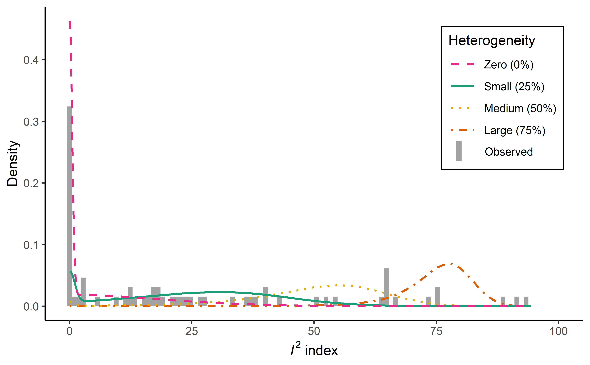

```{r setup, include=FALSE}
knitr::opts_chunk$set(echo = FALSE, message = FALSE, warning = FALSE)
```

```{r load packages, data and source functions}
if(!require(readr)){install.packages("readr")}
if(!require(metafor)){install.packages("metafor")}
if(!require(dplyr)){install.packages("dplyr")}
if(!require(purrr)){install.packages("purrr")}
if(!require(kableExtra)){install.packages("kableExtra")}

library(readr) #To load data
library(dplyr) #For data transformation
library(purrr) #For data iteration
library(metafor) #To run meta-analyses
library(kableExtra) #For creating good-looking pdf tables


dat <- read_csv("../data/collated_summary_data.csv")

source("../code/helper_functions_tables_figures.r") #Load functions to prep data for figures
```
Empirical research is typically portrayed as proceeding in two stages. First, belief in the existence of an effect is established. Second, its generalizability is examined by exploring its boundary conditions. In the first stage, inferential statistics are used  to minimize the risk that a discovery is due to sampling error.  In the second stage, one may ask to what extent the effect depends on a particular choice of four contextual factors; the 1) sample population, 2) settings, 3) treatment variables and 4) measurement variables [ref: Campbell & Stanley]. This extent is often explored through replications of the original study that are either as similar as possible to the original (called 'direct' or 'exact' replications) or with some deliberate variation on conceptual factors (so-called 'conceptual' or 'indirect' replications) [ref: Zwaan et al], and once sufficient studies have accumulated through meta-analysis. In meta-analysis, the heterogeneity of an effect size (henceforth referred to as heterogeneity) is a measure of an effect's susceptibility to changes in these four factors. An effect strongly dependent on one or more of the four factors, unless controlled for, should exhibit high heterogeneity. In this paper we examine what degree of heterogeneity can be expected in replication studies in psychology and explore a proposed relationship with effect size. We focus in this paper on direct replications.

Heterogeneity is of concern for several reasons. First and foremost, unaccounted for heterogeneity can have unacceptable consequences. This may be most readily evident for medicine, where in the case of heterogeneity an intervention that is successful for some may have direct negative health consequences for others. However, the adoption of psychological research for business, law enforcement, and policymaking in general (e.g., the widespread use of 'nudges'; https://www.knowablemagazine.org/article/society/2018/nudging-grows-and-now-has-government-job) means its impact can be widespread and the consequences of heterogeneity should be no less of a concern for psychologists.

 Second, unaccounted for heterogeneity is an indication of incomplete theory, since it suggests that a theory is unable to predict all contextual factors of importance to its claims. As such, heterogeneity might imply previously unknown predictors, so called 'hidden moderators' [ref: van Bavel], the discovery of which can be seen as an opportunity for theoretical advancement [ref: Tacket et al]. The corollary is that, unless a theory has predefined additional assumptions ('auxiliary assumptions' [ref: Earp & Trafimow]) which were not fulfilled in the replications, an absence of heterogeneity should generally preclude referral to hidden moderators. 
 
 Third,  the possibility of heterogeneity can create controversy in the interpretation of single replication results. The proclamation of a  'failure' to replicate an effect often seems to imply that the original find was merely a statistical fluke, due to 'p-hacking' [Ref: Simmons et al] or publication bias [ref.. Inzlicht?]. Unsurprisingly, some researchers take offense [e.g., ref: Baumeister]. An alternative explanation for non-replication, often espoused by the original authors [e.g, IJzerman; Strack], is that the effect is more heterogenous than (perhaps implicitly) claimed originally. Such explanations may be valid or not, but even if valid, an effect is typically of less general interest the more specific circumstances it requires to appear. A way for original authors to align researchers' expectations of heterogeneity is to preemptively specify their own, that is, the degree of heterogeneity that would make they themselves lose interest in an effect (e.g., by declaring 'constraints on generality' [ref Simons et al].

Fourth, meta-analytic techniques are affected by heterogeneity. Techniques that attempt to correct for publication bias in their estimate tend to fail in the presence of heterogeneity [refs: Inzlicht; McShane], which is problematic considering widespread publication bias [refs] and its impact on meta-analytic estimates. In addition, heterogeneity alters the interpretation of meta-analytic estimates as either _the_ true effect size (under homogeneity) or the average of the true effect sizes (under heterogeneity), though one may question the usefulness of interpreting the average true effect size in the presence of heterogeneity [ref: blog Simonsohn], just as it may be questionable to interpret an average main effect in the context of an interaction effect [ref Aiken and West 1993].

It is a commonly believed that heterogeneity is the norm in psychology.  In support of this notion, recent large scale reviews of meta-analyses in psychology [ref: Stanley; van Erp et al] report median heterogeneity levels that can best be described as 'large' (see next paragraph). In comparison, the median heterogeneity estimate in medicine would be considered 'small' by the same standard [ref: Ioannidis  "uncertainty in heterogeneity"]. It may simply be that effects in psychology are more heterogenous than those of medicine. However, meta-analyses in psychology also typically include more studies than those in medicine, and it could be that they tend to include studies from a much broader spectrum than meta-analyses in medicine. The median number of studies (effects) per meta-analysis in the psychology sample of [van Erp et al] was 12, whereas in the medicine sample of  [Ioannidis; uncertainty in heterogeneity] the median number of studies was only 7, despite exclusion of all meta-analyses of 3 or fewer studies. It is difficult to separate these explanations. To facilitate doing so, in this paper we focus on meta-analyses of only direct replications, which are exempt from the potential problem of including too disparate studies. In reference to meta-analyses of direct replications, several authors [ref: McShane et al; Tacket et al] have argued that if we were to expect heterogeneity to be absent or minimal anywhere, it would be in pre-registered multi-lab projects with a common protocol, and that heterogeneity has been reported even under such circumstances [e.g., ref: Many Labs 1] is an indication of widespread heterogeneity in psychology. However, even in the case of multi-lab direct replication projects, studies vary on two contextual factors (sample population and settings) and if we believe an effect is sensitive to changes in these two factors we might still expect to find some heterogeneity

One problem lies in the assessment of heterogeneity and its inherent uncertainty. Heterogeneity is often measured by the I2 index [ref: Higgins & Higgins], which allows comparison of estimates across meta-analyses and has an intuitive interpretation. It can be interpreted as the percentage of variability in effect sizes that is due to heterogeneity amongst the true effects (that is, sensitivity to contextual factors) rather than sampling variance, and ranges from 0-100%. The I2 index is a transformation of the well-known Q-test of heterogeneity in meta-analysis [ref: Cochran] by taking $[Q - (k - 1)] / Q \times 100$%, where k is the number of studies included in the meta-analysis and a negative I2 is set to zero.  [Higgins et al] tentatively defined I2-values of 25, 50, and 75% as small/medium/large heterogeneity respectively. Tests of heterogeneity typically have low statistical power in many practical situations [ref: Jackson; Huedo-Medina]. This complicates the discussion of heterogeneity, because while I2 always provides an estimate of heterogeneity, this estimate is often surrounded by wide confidence intervals [ref: Ioannidis  "uncertainty in heterogeneity"]. For example, Ioannidis reports that in a large set of Cochrane meta-analyses, all meta-analyses with I2 point estimates of 0% had upper 95% confidence intervals that exceeded 33%, exceeding what [Higgins] defined as 'small' heterogeneity. In addition, under homogeneity I2 has a central chisquare distribution [ref: von Hippel], a distribution that is right-skewed with more than 40% of observations falling above the expected value (for all k > 4). In other words, even in the absence of heterogeneity, a meta-analysis of 5 or more studies will have an I2 point estimate above zero in more than 40% of cases. Heterogeneity estimates may thus be congruent with a wide range of true heterogeneity levels. Despite exhortations to the contrary [ref: Ioannidis "uncertainty in heterogeneity"] , it remains common to omit confidence intervals in the reporting of I2. In consideration of such uncertainty and the prevalent belief that heterogeneity is the norm in psychology, we examine the existing evidence for heterogeneity in psychology using a sample of pre-registered multi-lab direct replication projects.

Effect size likely influences heterogeneity. Intuitively, it makes sense to believe that if there is no meta-analytic effect there is nothing to moderate (i.e., no heterogeneity). However, a null or near null effect size estimate may arise from failure to consider contextual factors ('hidden moderators', [ref: van Bavel]) and does not by itself imply the absence of heterogeneity. A large meta-analytic effect size on the other hand, can be expected to be associated with more heterogeneity. To illustrate, consider a meta-analysis of say, the correlation between neuroticism and procrastination. Each included study would need to measure the two variables somehow, possibly the same way across studies. However, because of individual differences, measurement is not equally exact for everyone, and between studies the measurement reliabilities may differ either due to sampling variance (that the sample happens to be more or less homogenous) or to differences in contextual factors (e.g., sampling population, method of measurement). This means that even if the underlying true effect size is the same, the observed correlation between the two variables will differ between studies. Keeping measurement reliabilities constant, differences in observed effect sizes will increase with the underlying true effect, resulting in more variability being ascribed to heterogeneity. More formally, an observed correlation $r_{xy}$ can be expressed as the product of the true correlation or effect size, $\rho_{xy}$, multiplied by the square root of the measurement reliabilities for X ($R_{xx'}$) and Y ($R_{yy'}$): $r_{xy} = \rho_{xy} \times \sqrt{R_{xx'}} \times \sqrt{R_{yy'}}$. As such, if $\sqrt{R_{xx'}} \times \sqrt{R_{yy'}}$ stays constant while $\rho_{xy}$ increases the observed differences between studies will also increase, thereby increasing heterogeneity of observed effect sizes (see Table 1). We explore the association between effect size and heterogeneity in a sample of pre-registered multi-lab replication projects.

Table 1.

_Heterogeneity may increase with effect size_

We examine the evidence for widespread heterogeneity in psychology and explore the correlation between effect size and heterogeneity, using 10 pre-registered multi-lab replication projects in psychology (Table 2). These 10 projects examined a total of 37 primary outcome variables and arguably represent the best, least biased, meta-analytic data currently available in psychology. To better interpret heterogeneity estimates we also estimate power of each project to find zero/small/medium/large heterogeneity as defined by [Higgins et al]. Of the four contextual factors a study might vary on (sample population, settings,  treatment variables, and measurement variables) the studies in these projects vary only on two: sample population and settings. Nonetheless, if we believe an effect is sensitive to changes in these two factors we may still expect to find some heterogeneity. For example, the variety of countries and samples involved in some of the replication projects, not all of which are WEIRD (Western, Educated, Industrial, Rich, Democratic [ref: Weird]) might be a reason to expect heterogeneity. On the other hand, it may be that the less disparate collection of studies included in these direct replication meta-analyses as compared to most psychological meta-analyses result in low heterogeneity estimates, similar to estimates in medicine. Regardless of outcome, the sampled multi-lab replication projects can only inform us of susceptibility to changes in the varied contextual factors  (sample population and settings), with no information on susceptibility to changes in other contextual factors.

Table 2.

_Pre-registered multi-lab replication studies_

##Method

All code and data for this project are available on the Open Science Framework (OSF) at osf.io/XXXX. We refer to relevant files on OSF using brackets and links in the sections below, that is (osf.io/XXXX/). We ran all analyses using R version X [ref: R citation].

We downloaded and collated summary data from ten pre-registered multi-lab replication projects in psychology (Table 2). Data from all ten projects were publicly available on the Open Science Framework (osf.io) and downloaded between 2018/02/01 and 2018/03/31. Although some projects (e.g. RRR4) reported results from several outcome variables, we only included primary outcome variables as stated in accompanying publications, resulting in a total of 37 effects. For each effect we extracted (osf.io/XXXX/) summary data (e.g., means and standard deviations) at the level of the lab as specified by the original authors for their primary analysis (i.e., typically after exclusions). We extracted information on the country of each lab, whether participants were physically in the lab for the study, total number of participants per lab, type of effect size, and additional information related to each effect (see codebook; osf.io/XXXX/). Extracted data were in a variety of formats: Excel (Many labs 1, RRR1 & RRR2), CSV (Many labs 3, RRR3, RRR4, RRR5, RRR6) and as PDF tables (RRR7, RRR8). In two cases (RRR5 and RRR6) it was necessary to download the raw data to extract summary data. Although a particular lab may have participated in several projects, the lab indicator was typically not the same across projects. Even so, we kept the original lab indicators to facilitate comparing observations in our dataset with the original datasets. Finally, we collated the summary data for all effects into one dataset for analysis (osf.io/XXXX/). 

To examine heterogeneity across effects, we computed meta-analytic estimates for all 37 effects in our dataset (Table 3). We ran all analyses as specified by the replication authors (osf.io/XXXX/). All effects were estimated with random-effects models and the Restricted Maximum Likelihood (REML) estimator using the R-package metafor [ref], though with a variety of outcome variables: correlations, standardized mean differences, raw mean differences, odds ratios and risk differences. ML1 transformed odd ratios into standardized mean differences when meta-analyzing under the assumption that responses followed logistic distributions [ref: Sanchez-Meca; metafor]. Two projects (RRR5 and RRR7) used the Knapp and Hartung adjustment of the standard errors [ref: Knapp & Hartung] and ML3 correlations were corrected for bias [ref: Hedges 1989; metafor]. After estimating effects, ML3 transformed correlations into eta-squared for reporting, which we did not. For each effect we estimated $I^2$ and its 95% confidence interval. Confidence intervals were calculated in metafor which uses the Q-profile method [ref Jackson 2014].

In order to facilitate interpretation of our results, we estimated power and type 1 error for each of the 37 effects under zero/small/medium/large heterogeneity ($I^2$ = 0/25/50/75%  respectively). In addition, we plotted $I^2$-distributions across effects at these heterogeneity levels and compared with all observed $I^2$ estimates. To do so we simulated results for each effect given the number of studies, k, and the sample sizes, $N_k$, of those studies (osf.io/XXXX/). In the case of correlations we 1) generated a true correlation $\rho_k$ from a normal distribution with  between studies standard deviation $\tau$ and mean effect size zero, $\rho_k \sim N(0,  \tau)$, and 2) generated an observed correlation expressed as Fisher's z $rz_k$ from a normal distribution with mean $\rho_k$ and standard deviation $\sqrt{1 / N_k - 3}$, $rz_k \sim N(\rho_k, \sqrt{1 / N_k - 3})$. For mean differences we assumed equal within study group sizes $n_c = n_t$ ($= N_k$ rounded to closest integer) and standard deviation $\sigma_c = \sigma_t$. We then 1) generated study effect sizes $\mu_k$ from a normal distribution with mean zero and standard deviation $\tau$, $\mu_k \sim N(0, \tau)$, and 2) generated control and treatment means from the sampling distributions $\bar{x}_c \sim N(0, 1 / \sqrt{n_c})$ and $\bar{x}_t \sim N(\mu_k, 1 / \sqrt{n_t})$ respectively. Group variances were generated from their sampling distributions as well, in accordance with $s^2_c = \chi^2 (n_c - 1) / (n_c - 1)$ and  $s^2_t = \chi^2 (n_t - 1) / (n_t - 1)$. Due to the difficulties of data generation for odds ratios and risk differences we treated these as mean differences. For each effect, our simulations then proceeded in three steps: i) we varied the between studies standard deviation, $\tau$, between 0.000 and 0.50 in increments of 0.005 and replicated each condition 1000 times, each time estimating $I^2$ with a random effects model with REML, ii) we computed the average $I^2$ in each condition, discarding non-converged models, and iii) ran 10 000 replications at the $\tau$ values in step _ii_ that best corresponded to an $I^2$ estimate of 25% (small), 50% (medium) and 75% (large). For homogeneity we set $\tau$ to zero. We considered a result significant when the lower bound of the 95% $I^2$ confidence interval was above zero. 

To examine the correlation between effect size and $I^2$ we converted all effect sizes to a common metric (osf.io/XXXX/). We first converted all effects into correlations (r) and used the R-package metafor [ref] to estimate $I^2$ and meta-analytic effects expressed as Fisher's z. In doing so, we fitted random-effects models with metafor's default REML estimator. Fisher's z is a normalizing correlation transformation that ranges from negative infinity to positive infinity, though except for extreme correlations it stays close to the -1 to 1 range [ref]. For mean differences we calculated the pooled standard deviation, [ref Borenstein in Cooper & Hedges, 2009, p. 226), standardized the effect size and converted it to a correlation (p. 234) with a correction factor for unequal sample sizes (p. 234). In one case (RRR8), we first had to convert reported standard errors into pooled standard deviation (p.224). For risk differences and odds ratios we first added 1/2 to a cell if it was empty to avoid dividing by zero, next calculated the logarithmic odds ratio (p. 266), converted this to Cohen's d (p. 232) and then finally to a correlation. All formulas used are presented in Appendix A (osf.io/XXXX/).  Since $I^2$ is set to zero for the majority of cases under homogeneity (i.e., truncated), we also correlated effect size with with the closely related heterogeneity estimate H2 [ref: Higgins 2002] as a sensitivity analysis. The H2 index is calculated as $H2 = Q  / (k - 1)$ and equals $1 / (1 - $I^2$)$ for $I^2 \geq 0$. It ranges from zero to positive infinity, where a larger score indicates more heterogeneity, a score of one indicates homogeneity, and a score between zero and one thus indicates 'excessive' homogeneity.  

##Results

Table 3 presents the meta-analytic estimates and $I^2$ with confidence intervals for each of the 37 included effects. 

```{r prep-heterogeneity-table}
# library(metafor)
# library(dplyr)
# library(purrr)

#fit a random effects model to all empirical data
#Each set of input datapoints is meta-analyzed as per the original replication project
#Function 'est_heterogen_smd_raw' is sourced
res <- dat %>% 
  split(.$effect) %>%  #separate by effect, necessary step otherwise the function is applied overall
  map_dfr(est_heterogen_smd_raw, .id = "effect") #apply function, rbind results into dataframe ('dfr'), make sure purrr is up to date


#Add rs and k to the data-frame and prep for table
het <- dat %>% 
  select(rs, Site, effect, effect_type) %>% 
  group_by(rs, effect) %>% 
  summarize(effect_type = unique(effect_type),
            k = n_distinct(Site)) %>% 
  left_join(res) %>% 
  mutate(effect_type = recode(effect_type, 
                              d = "SMD.",
                              'Raw mean difference' = "MD",
                              'Risk difference' = "RD")) 

#Load simulation results (power/type 1 error for all effects)
dens <- readRDS("../code/temp_sim_results_2.RDS")
names(dens) <-  sort(unique(dat$effect)) #names were alphabetized upon splitting in simulation so must sort

#Summary of simulation results, needs to be combined with main part of table
I2_ci_lb <- dens %>% 
  bind_rows(.id = "effect") %>% 
  group_by(effect, tau_index) %>% 
  summarize(power = mean(ci.lb > 0)) %>% #Estimate power/type 1 error for each tau level and effect
  ungroup() %>% 
  tidyr::spread(key = tau_index, value = power) %>% #prep for table
  rename(zero = '1', small = '2', medium = '3', large = '4')

#Combine dataframes to create full table
het <-  het %>% 
  left_join(I2_ci_lb) %>% 
  select(rs, effect,k , everything()) %>% 
  arrange(desc(s_I2),  desc(s_ci.ub)) #sort by I2 and upper CI bound

```

Table 3.

_Heterogeneity across primary effects in ten multi-lab replication projects._
```{r heterogeneity-table}
#library(kableExtra)

het %>% knitr::kable(digits = 2, col.names = c("RS", "Effect", "k", "Effect type", "Estimate", "I2(%)", "ci.lb", "ci.ub", "Zero", "Small", "Medium", "Large")) 
```

**Note:**  Effects were estimated in metafor using REML. The following effects are odds ratios transformed into standardized mean differences: 'Allowed vs. forbidden', 'Gain vs. loss framing', 'Norm of reciprocity', 'Low vs. high category scales'. RP = Replication Project, k = no. primary studies, Estimate = Point estimates of effect sizes, ci.lb = lower bound of $I^2$ 95\\% confidence interval, ci.ub = upper bound of $I^2$ 95\\% confidence interval. SMD = Standardized Mean difference (Hedge's g), MD = Mean Difference, RD = Risk Difference, r = correlation. Under simulated heterogeneity, Zero = simulated type 1 error, and the other headers represent simulated power under small/medium/large heterogeneity ($I^2$ = 25/50/75\\%) respectively.  (OSF.io/XXXX)"

###$I^2$ estimates and confidence intervals

There is limited evidence for heterogeneity across the examined effects. Of the 37 effects,  4/37 (11%) have $I^2$ estimates that best correspond to large heterogeneity ($I^2$ = 75%), 4/37 (11%) to medium heterogeneity ($I^2$ = 50%), 9/37 (24%)  to small heterogeneity ($I^2$ = 25%) and 17/37 (54%) to zero heterogeneity ($I^2$ = 0%). However, despite relatively large k and total sample size for most projects (see Table 2), Table 3 shows wide confidence intervals for many effects: 10/37 (27%) effects have confidence intervals congruent with small to large heterogeneity and 15/37 (41%) with zero to medium.  The lower bound $I^2$ confidence interval excludes zero for only 7/37 effects (19%; Table 3), all part of the ML1 project. The percentage of heterogeneity estimates larger than 0 (23/37; 62%) suggests heterogeneity for at least some effects, as this percentage is higher than the expected frequency of non-zero estimates under homogeneity (46%, or about 17/37), based on the chi-square distribution and average k across projects. 

###$I^2$ and power

We estimated $I^2$ for a large range of between studies standard deviations for each of the 37 effects (Figure 1). The $I^2$ index increases non-linearly with heterogeneity and is relatively more sensitive to lower between studies variances. This appears to be less so in the case of  mean differences than for correlations, which correspond to the more steeply inclined curves in Figure 1.

```{r}
knitr::include_graphics("../figures/tau-I2.png")
```

_Figure 1. Result of simulation relating $I^2$-values to between studies standard deviation. Each line represent one of 37 effects. The more steeply inclined lines belong to correlations and the others to mean differences._

Power and type 1 error estimates for zero/small/medium/large heterogeneity are shown for each effect in Table 3. In all cases the type 1 error is conservative, as compared to the expected 5% error rate. Power to detect small heterogeneity was low, ranging between 18% (Professor priming) and  45% (Flag priming), with an average of 28%. Power to detect medium heterogeneity was generally good, with an average of 79% power, but was only around 60% for several effects with low K. Power to detect strong heterogeneity was excellent across the board. 

Figure 2 shows the distribution of $I^2$ at different heterogeneity levels and a histogram of the observed effects. The shortest bars in the histogram correspond to a single effect. The considerable overlap of the distributions illustrates why sufficient power can be difficult to achieve, and why confidence intervals for $I^2$ are often wide. In particular the spread of the distribution under small heterogeneity is illustrative of the low power to be expected under such circumstances. Given the densities of the distributions (height of the curves) the majority of observed effects are most likely to have either zero or small heterogeneity.  Only two effects appear to be of medium heterogeneity and three of large.

```{r}

```

_Figure 2. Simulated $I^2$ densities across 37 effects for zero, small, medium, and large heterogeneity according to the definitions of [Higgins], and a histogram of the observed $I^2$ estimates for the 37 effects. Each simulated density consists of approximately 1,480,000 point estimates._

###$I^2$ and effect sizes

Larger effect sizes appear to be associated with higher heterogeneity estimates. In Table 3, the four effects with highest $I^2$ estimates also have the largest effect sizes. As expected, heterogeneity tends to increase with (absolute) effect size, with effect size sufficient to explain 61% of variation in $I^2$ estimates according to a simple regression model (Figure 3). The closely related, but unbounded, heterogeneity estimate $H^2$ provides a similar result ($R^2$ = .53). Excluding Anchoring effects as robustness check makes little difference ($R^2$ = .51 for $I^2$). 

```{r}
knitr::include_graphics("../figures/effect_het.png")
```

_Figure 3. The correlation between A) $I^2$ and effect size and B) $H^2$ and effect size for 37 effects from ten pre-registered multi-lab replication projects._

##Discussion

There is little evidence for heterogeneity amongst current pre-registered multi-lab replication projects in psychology. Across 10 projects, only 7/37 (19%) of primary outcomes had confidence intervals that excluded zero heterogeneity. Moreover, while each replication of an effect only varied on two contextual factors (sampling population and settings), the effects that showed evidence for heterogeneity were primarily effects that might have been expected to be sensitive to the changes in sampling population. Save two effects (Anchoring - Everest and IAT correlation math), all other effects that demonstrated heterogeneity were related to the US. They either asked questions about the US (anchoring effects), persons related to the US (Quote attribution) or issues that are well-known to generate strong debate in the US (i.e., free speech; allowed vs. forbidden). Although ML1 tested US vs. non-US as a moderator of heterogeneity and found very small effect sizes, these are all effects for which heterogenous responses also within the US would be unsurprising (e.g., someone living close to Chicago is more likely to know the population of Chicago). Our results suggest little reason to believe heterogeneity is the norm in psychology, and thus imply that citing heterogeneity as a reason for non-replication of an effect is unwarranted unless predicted _a priori_. 

Complicating the discussion of heterogeneity is that there amongst the studied effects was a clear association between effect size and heterogeneity. There are thus both good theoretical (see introduction) and empirical reasons to expect larger effect sizes to exhibit comparatively more heterogeneity when using observed effect sizes in a meta-analysis. Since not all measurements (e.g., behavioral) admit adjusting for reliability as easily as questionnaires, a potential correlation between effect size and heterogeneity could be difficult to control for. However, the relatively small number of effects in our sample means this association might be an artifact of the data. 

There are some additional limits to the generalizability of claims based on the data in our study. For one, the included effects are neither a representative nor random sample of effects in psychology and as such do not support making strong claims about average heterogeneity levels in psychology. In respect to this point we look forward to the forthcoming Many Labs 2 project which should provide considerable new data on the prevalence of heterogeneity in psychology. In addition, while both the I2 confidence intervals and distribution of point estimates support a small number of heterogenous effects amongst those studied, most confidence intervals are congruent with anything from low to high heterogeneity as defined by [Higgins et al]. As always, absence of evidence is not evidence of absence. Finally, since the included studies only vary on two contextual factors (sample population and settings), the data tell us nothing about the included effects' susceptibility to changes in the other two factors (treatment and measurement variables).

To conclude, evidence does not appear to support the belief that heterogeneity is the norm in psychology. Large-scale reviews of meta-analyses in psychology suggest considerable heterogeneity across the field of psychology [ref: Stanley; van Erp et al]. However, in our experience psychologist tend to include widely varying studies in their meta-analyses, sometimes varying on all four contextual factors (or more). This is perhaps unsurprising considering the lack of theory delineating boundary conditions in psychology [ref: Simons et al].  Our sample, despite consisting of the arguably best, least biased, meta-analytic data currently available in psychology, was unfortunately relatively small and not representative of the many varied effects studied in psychology. As such we are enthusiastic about the many multi-lab initiatives in psychology (Registered Replication Reports, Many Labs 2, ManyBabies, the Psych Science Accelerator) which in the future will provide considerable new data and enable researchers to re-evaluate the prevalence of heterogeneity in psychology. At current there is little evidence to support the notion that heterogeneity is widespread in psychology. 

##References